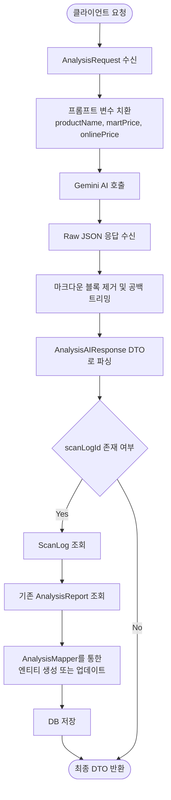

# PicPick AI Analysis Logic Flow

이 파일은 PicPick 서비스의 AI 분석 로직 흐름을 시각화한 것입니다.



## 상세 단계 설명

1. **요청 수신**: 클라이언트로부터 상품명, 마트 가격, 온라인 최저가, 그리고 (선택사항) 스캔 로그 ID를 받습니다.
2. **프롬프트 준비**: 하드코딩된 `ANALYSIS_PROMPT` 내의 중괄호 변수들을 실제 값으로 대체합니다.
3. **AI 호출**: Spring AI를 사용하여 Gemini 모델에 분석을 요청합니다.
4. **응답 정제**: AI가 응답에 포함할 수 있는 ```json ... ``` 형태의 마크다운 형식을 제거하고 순수 JSON 데이터만 추출합니다.
5. **역직렬화**: Jackson `ObjectMapper`를 사용하여 JSON 문자열을 Java 객체(`AnalysisAIResponse`)로 변환합니다.
6. **Persistence (저장 logic)**: 
    - `scanLogId`가 전달된 경우, 해당 로그와 연관된 기존 분석 리포트가 있는지 확인합니다.
    - 리포트가 있다면 기존 데이터를 업데이트하고, 없다면 새로 생성하여 중복 데이터 방지(Unique Constraint) 로직을 수행합니다.
7. **결과 반환**: 최종적으로 구조화된 분석 데이터를 클라이언트에 응답으로 보냅니다.
