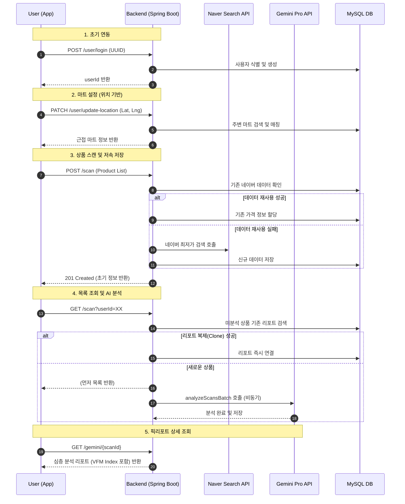

# PicPick User Journey Flow

이 문서는 사용자가 PicPick 서비스를 이용하며 거치는 단계별 로직과 데이터 흐름을 시각화한 것입니다.

## User Flow

---

## 단계별 상세 여정

### 1. 익명 로그인 (UUID 기반)
- 사용자는 번거로운 가입 없이 앱을 켜는 순간 부여된 UUID로 로그인합니다.
- 서버는 UUID를 기반으로 사용자의 마일리지(스캔 횟수) 및 히스토리를 관리합니다.

### 2. 스마트 마트 탐지
- 사용자가 마트에 입장하여 '위치 인증'을 하면 가장 가까운 마트의 DB가 활성화됩니다.
- 해당 마트의 전용 할인 상품(행사 상품) 정보와 연동될 준비를 마칩니다.

### 3. 멀티 스캔 및 데이터 최적화
- 사용자가 여러 상품을 동시에 스캔합니다.
- **최적화 로직**: 
    - 이미 다른 사용자가 스캔했던 상품이라면 네이버 API를 중복 호출하지 않고 예전 데이터를 재사용합니다.
    - 유료 API인 Gemini 호출 이전에, 이미 산출된 '픽단가(단위 가격)'가 있는지도 확인하여 비용을 절감합니다.

### 4. 하이브리드 리포트 생성 (동기+비동기)
- **동기 복제**: 사용자가 스캔 목록을 보는 즉시, 기존에 분석되었던 동일 상품의 리포트를 찾아서 복제(Clone)하여 연결합니다. 사용자는 기다리지 않고 리포트를 바로 볼 수 있습니다.
- **비동기 분석**: 세상에 없던 새로운 상품일 경우에만 백그라운드에서 AI 분석이 시작됩니다.

### 5. 프리미엄 소비 리포트 (Pick-Report)
- 최종적으로 사용자는 VFM(가성비) 점수, 품질 요약, 결론(사라/마라)이 포함된 리포트를 받아봅니다.
- 이 리포트는 추후 동일 상품을 스캔하는 다른 사용자들에게 공유되어 전체 시스템의 속도를 높이는 데 기여합니다.
