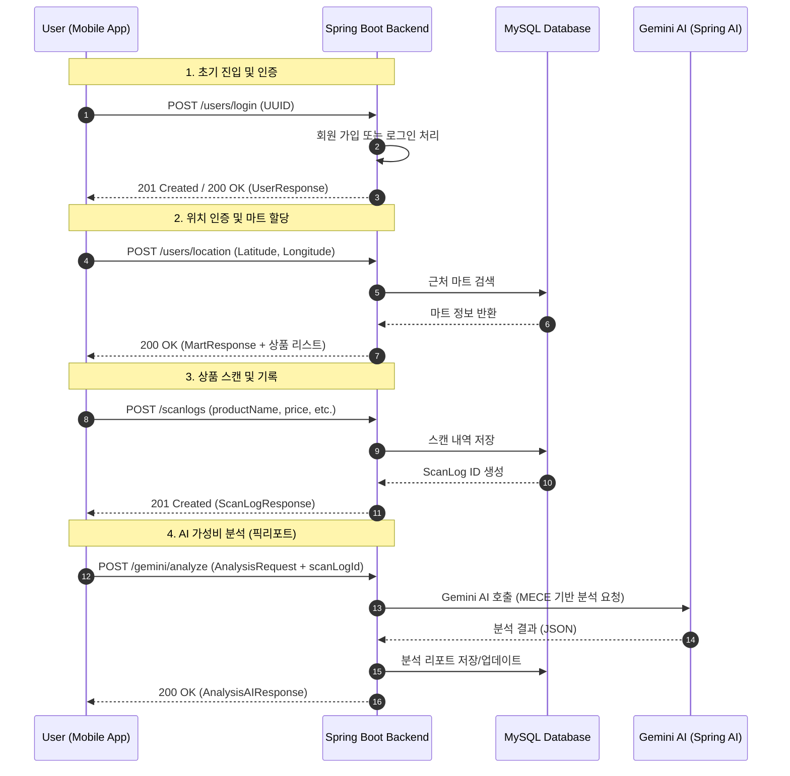

# PicPick User Journey Flow

이 파일은 사용자가 PicPick 앱에 진입하여 상품 분석 리포트를 받기까지의 전체 여정을 시각화한 것입니다.

## 단계별 상세 설명

### 1. 게스트 로그인
- 사용자는 복잡한 가입 절차 없이 기기 고유의 UUID를 통해 즉시 서비스를 이용할 수 있습니다.
- 백엔드는 UUID가 처음인 경우 자동으로 계정을 생성하고, 이미 존재하는 경우 로그인 처리를 합니다.

### 2. 위치 인증 (Geofencing)
- 앱 진입 후 사용자의 현재 위치(위도, 경도)를 확인합니다.
- 서버는 반경 내 등록된 마트가 있는지 확인하고, 해당 마트의 최신 전단 상품/할인 정보 리스트를 사용자에게 제공합니다.

### 3. 상품 스캔
- 사용자가 마트에서 구매하려는 상품의 이름과 가격을 입력(스캔)합니다.
- 이 데이터는 나중에 분석의 기초가 되며, 사용자의 스캔 이력에 저장됩니다.

### 4. AI 픽리포트 분석
- '분석하기' 버튼을 누르면 인공지능이 개입합니다.
- 단순히 "비싸다/싸다"가 아니라, **PicPick 전용 VFM(Value for Money) 공식**과 **7대 MECE 카테고리 로직**을 적용하여 상품의 미시적인 가치(한 끼당 가격, 원재료 가치 등)를 분석합니다.
- 최종적으로 가공된 리포트는 DB에 저장되어 언제든 다시 확인할 수 있습니다.
